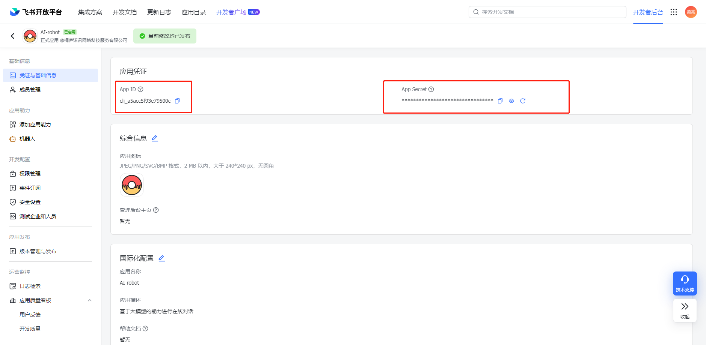
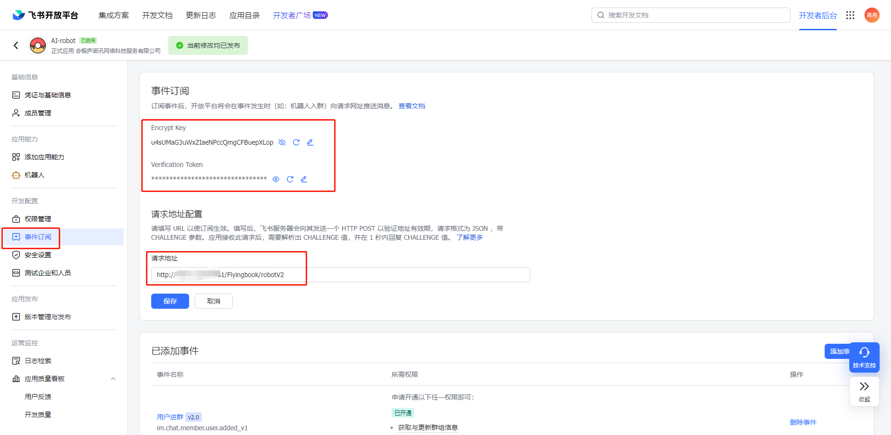
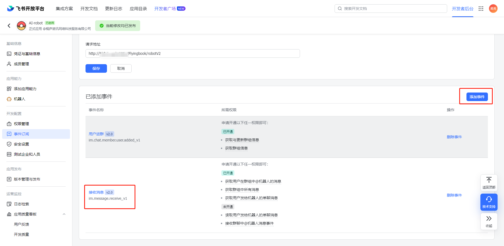
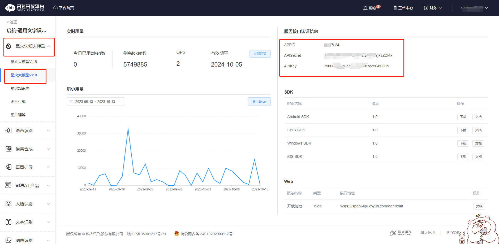
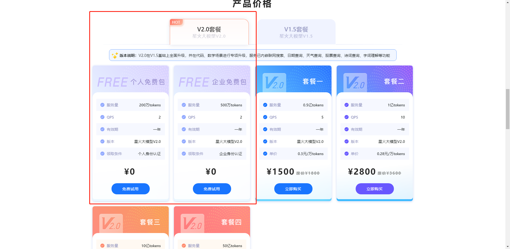
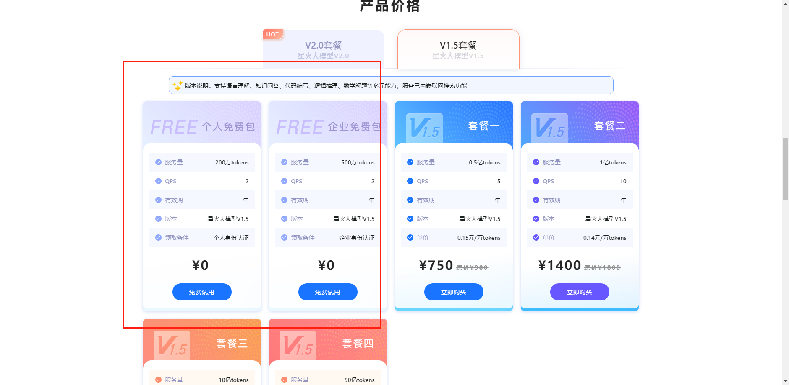

# Feishu-robot

#### 介绍
基于技术栈SpringBoot 结合飞书机器人能力和星火大模型实现的 流式输出打字机效果问答机器人

## 飞书开放平台
https://open.feishu.cn/app

### 1.应用凭证
App ID、 App Secret

### 2.事件订阅安全验证
Encrypt Key和  Verification Token 用于验证请求是否合法

### 3.事件订阅
订阅：接收消息即可，其他事件随意

### 4.权限管理
接收群聊中@机器人消息事件
读取用户发给机器人的单聊消息
获取用户发给机器人的单聊消息
获取与发送单聊、群组消息
以应用的身份发消息

## 星火大模型安全验证

### 星火大模型V2.0控制台
https://console.xfyun.cn/services/bm2
### 安全校验
APPID、APISecret、APIKey

###  免费星火大模型Tonke申请支持V2.0和V1.0，目前个人认证均可免费申请200万Token，企业认证均可申请500万Token

https://xinghuo.xfyun.cn/sparkapi

